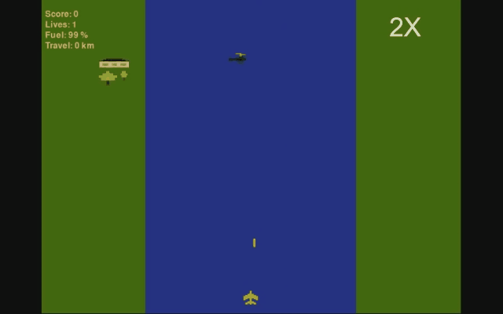

# River Raid 2020
A recreation of River Raid, the famous Atari 2600 game, built for reinforcement learning,
plus Covid Raid, a spin-off made during the 2020 lockdown.



> The original 2020 version (TensorFlow/Keras DQN) is preserved under the git tag
> [`v1.0-legacy-2020`](../../tree/v1.0-legacy-2020). The gif above was made by that agent.

## Installation
Python 3.10 or newer.
```
pip install -e ".[train,dev]"
```
On Linux `pip install torch` ships with CUDA support, so an RTX 3090 works out of the box.
Check with `python -c "import torch; print(torch.cuda.is_available())"`.
If you only want to play, `pip install -e .` is enough.

## Play the game
```
python play_river_raid.py    # arrows: steer / speed up / slow down, space: shoot, p: pause
python covid_game.py         # the covid raid spin-off
```

## Train an AI agent
```
python train.py
```
This trains a PPO agent with the defaults below for 50M agent steps (200M game frames) and
logs to `runs/<timestamp>/`. Follow the training with TensorBoard:
```
tensorboard --logdir runs
```
The most useful curves are `charts/avg100_score`, `episode/minutes_survived` and `charts/SPS`.
Checkpoints are written to `runs/<run>/latest.pt` (every 50 updates and on ctrl-c) and
`runs/<run>/best.pt` (best 100-episode average score). Continue a run with
`python train.py --resume runs/<run>/latest.pt`. All options: `python train.py --help`.

Suggested settings for an RTX 3090:
```
# the default (~1.3M parameter IMPALA network)
python train.py --num-envs 64 --bf16

# a 4x wider network and more parallel games, if the CPU can keep up
python train.py --num-envs 128 --channels 32,64,64 --bf16 --total-steps 100000000
```
Game simulation runs on the CPU in `--num-workers` processes (default: all cores but one), the
network runs on the GPU. Watch `charts/SPS`: if the GPU is underused, raise `--num-envs`.

## Watch a trained agent
```
python watch.py runs/<run>/best.pt                           # opens the game window
python watch.py runs/<run>/best.pt --sample                  # sample actions instead of the most likely one
python watch.py runs/<run>/best.pt --record media/agent.gif  # record a gif instead
```

## Use the environment in your own code
The game is a standard [Gymnasium](https://gymnasium.farama.org) environment:
```python
import gymnasium as gym
import river_raid   # registers RiverRaid-v1

env = gym.make('RiverRaid-v1', render_mode='human')
obs, info = env.reset(seed=0)
while True:
    obs, reward, terminated, truncated, info = env.step(env.action_space.sample())
    if terminated or truncated:
        break
print(info['score'])
```

| | |
|---|---|
| Observation | last 4 frames, 96x96 grayscale (`uint8`, shape `(4, 96, 96)`); the bottom 2 rows of each frame are a fuel gauge |
| Actions | `NO_MOVE, LEFT, RIGHT, LEFT_SHOOT, RIGHT_SHOOT, SHOOT`, each repeated for 4 game frames |
| Reward | +0.01 per frame alive; points from shooting / 100 (helicopter 0.6, ship 0.4, fuel tank 0.8); +0.15 per frame while refuelling below 40% fuel; -0.05 for reversing direction (left <-> right) within half a second; -2 on death. Ramming an enemy earns no reward |
| Fuel | a full tank lasts 1 minute and each tank you fly over gives ~10 s, so some tanks must be used and the rest can be shot (`fuel_capacity`, `refuel_rate`; the human game keeps its 7 minute tank) |
| Episode end | crash into a bank or an enemy, running out of fuel, or 30 minutes of game time (truncation) |

All of these are constructor arguments of `RiverRaidEnv` (`frame_skip`, `frame_stack`, `obs_size`,
`survival_reward`, `reward_scale`, `refuel_reward`, `refuel_below`, `reversal_penalty`, `reversal_window`, `death_penalty`,
`max_episode_frames`, ...) and options of `train.py`.

Why this reward: the game never gets harder, so a good agent should be able to fly forever, and
staying alive is rewarded directly. An earlier version paid for every frame spent over a fuel tank
and counted points for ramming enemies; an analysis of that agent showed 29 of 30 deaths were
collisions with enemies, it never dropped below 77% fuel, and almost 40% of its reward came from
chasing fuel tanks it did not need. The reversal penalty targets the twitchy, non-human
"short stroke" back-and-forth movement that RL agents tend to learn when changing direction is free.
It deliberately does not charge for starting or stopping: a version that penalized every steering
change taught the agent to never steer at all and just sit in the middle of the river shooting.

## The learning method
PPO ([Schulman et al. 2017](https://arxiv.org/abs/1707.06347)) with the IMPALA ResNet encoder
([Espeholt et al. 2018](https://arxiv.org/abs/1802.01561)), the combination behind most strong
results on pixel-based games when the simulator is cheap (Procgen, Atari, many game-AI projects).
The implementation (`river_raid/rl/ppo.py`) follows [CleanRL](https://github.com/vwxyzjn/cleanrl)
with generalized advantage estimation, clipped policy and value losses, advantage normalization,
return-based reward normalization, learning-rate annealing and correct bootstrapping when an episode
is cut off by the time limit.

Why PPO and not the newest sample-efficient methods (DreamerV3, EfficientZero, BBF)? Those shine when
every game frame is expensive (a real robot, the 100k-frame Atari benchmark). Here the game is ours
and runs at thousands of frames per second per CPU core, so a simple, stable on-policy method that
consumes hundreds of millions of frames gets further on one GPU in the same wall-clock time.

### What changed since 2020
* **Speed.** The 2020 training ran the game at a fixed 30 FPS with a window and sound, so the agent
  saw about 7 decisions per second. The game now runs headless with cached 32-bit sprites and no
  frame limit: ~1,500 agent decisions per second per CPU core, across many processes.
* **Full-length episodes.** Training episodes used to be cut at 650 frames (~20 s of play), so the
  agent never had to deal with fuel or long stretches of river. Episodes now last until the plane
  crashes (or 30 minutes of game time), and the agent can see a fuel gauge.
* **Bug fixes.** An un-fired bullet sitting under the plane could "shoot" enemies, giving free points;
  crashing into an enemy and a bank in the same frame cost two lives; the first frame stack of every
  episode overflowed (`uint8` pixels cast to `int8`); spawning used `random.randint` with floats,
  which fails on Python 3.12+; all parallel games shared one global random generator.
* **Algorithm.** Vanilla DQN with a 2-layer CNN, MSE loss, a 1M-transition replay buffer of Python
  objects (would have needed ~180 GB of RAM) and per-step `model.predict` calls, replaced by PPO with
  an IMPALA ResNet in PyTorch.
* **Libraries.** TensorFlow 2.2 / Python 3.6 / pygame 1.9 replaced by PyTorch, Gymnasium, pygame-ce
  and Python 3.10+.

## Project layout
```
river_raid/
    game/        the game engine: RiverRaid, CovidRaid and their entities
    env.py       Gymnasium environment (RiverRaid-v1)
    rl/          PPO: vectorized environments, IMPALA network, training loop
media/           sprites, sounds, the deterministic level (assets-position.csv)
settings.yaml    game presets
train.py         train an agent
watch.py         watch / record a trained agent
tests/           pytest
```
Run the tests with `pytest`.
