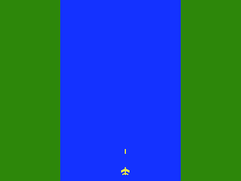

# River Raid 2020
A recreation of River Raid, the famous Atari 2600 game, built for reinforcement learning,
plus Covid Raid, a spin-off made during the 2020 lockdown.



The trained agent (`models/hunter.pt`) hunts enemies across the river, refuels when it runs low,
shoots the fuel tanks it does not need and flies through the narrow channels. Over 10 test games
capped at 10 minutes it survived 9.4 minutes on average and killed 93% of the enemies it met.

> The original 2020 version (TensorFlow/Keras DQN) is preserved under the git tag
> [`v1.0-legacy-2020`](../../tree/v1.0-legacy-2020); its agent is in
> [media/river_raid_ai_gameplay.gif](media/river_raid_ai_gameplay.gif).

## Installation
Python 3.10 or newer.
```
pip install -e ".[train,dev]"     # the game, training (PyTorch, TensorBoard) and tests
pip install -e .                  # only the game
```
On Linux `pip install torch` ships with CUDA support, so an NVIDIA GPU works out of the box.
Check with `python -c "import torch; print(torch.cuda.is_available())"`.

## Play the game
```
python play_river_raid.py    # River Raid
python covid_game.py         # the Covid Raid spin-off
```
| key | |
|---|---|
| left / right arrow | steer |
| up / down arrow | fly faster / slower |
| space | shoot |
| p | pause |

You have 3 lives. Fly over fuel tanks to refuel, and do not hit the banks or the enemies.

## Watch the trained agent
```
python watch.py models/hunter.pt                       # play until it crashes, 3 games, in a window
python watch.py models/hunter.pt --max-minutes 5       # end each game after 5 minutes of game time
python watch.py models/hunter.pt --sample              # sample actions instead of the most likely one
python watch.py models/hunter.pt --seed 7 --sound      # another river, with sound
python watch.py models/hunter.pt --record media/agent.gif --episodes 1 --max-minutes 1   # record a gif
```
`watch.py` takes any checkpoint, including `runs/<run>/best.pt` and `runs/<run>/latest.pt` of your
own runs. It always plays the game the way the agent was trained (observation, fuel tank size).

How `models/hunter.pt` plays, over 10 games capped at 10 minutes (most likely action each step):

| | |
|---|---|
| minutes survived | 9.4 on average, 8 of 10 games reached the 10 minute cap |
| score | 29,134 on average |
| enemies killed | 93% (385 per game) |
| steering changes | 1.9 per second |

It still occasionally crashes early: on one of the first 12 seeds it hit an enemy after 10 seconds.

## Train an agent
### Recommended recipe
```
FLAGS="--obs-style clean --survival-reward 0.0025 --reward-scale 0.02 --escape-penalty 0.5 --refuel-below 0.6 --low-fuel-shot-penalty 1.0 --bf16"
python pretrain.py $FLAGS --out runs/pretrain.pt
python train.py --init-from runs/pretrain.pt $FLAGS --num-workers 8 --run-name hunter
```
1. `pretrain.py` (about 3 minutes) records 200,000 steps of a scripted expert and trains the
   network to imitate it.
2. `train.py` improves that network with PPO. It runs 50M agent steps (200M game frames) by
   default, about 4 hours on an RTX 3090 with an 8-core CPU. `models/hunter.pt` is this recipe
   stopped after 37.7M steps (about 3 hours).

Give both commands the same reward and observation options: the value head is pre-trained on the
same reward, and the network must see the same kind of image. The sections below explain each choice.

### Follow the training
```
tensorboard --logdir runs
```
| curve | what it tells you |
|---|---|
| `episode/minutes_survived` | the main measure of progress |
| `episode/kill_ratio` | share of enemies shot (kills / (kills + enemies that got away)); about 0.9 when it hunts, below 0.6 when it camps in the middle |
| `episode/out_of_fuel` | 1 for games that ended with an empty tank; should be close to 0 |
| `episode/tanks_shot_per_min`, `episode/escaped`, `episode/kills` | how it treats fuel tanks and enemies |
| `episode/steering_changes_per_s` | how twitchy the steering is |
| `charts/avg100_score` | game score, averaged over the last 100 games |
| `charts/SPS` | agent steps per second |
| `losses/*` | PPO health: value, policy and entropy loss, approximate KL, clip fraction, explained variance |

The console prints a progress line after every update, with an ETA.

### Checkpoints, stopping and resuming
* `runs/<run>/latest.pt` is written every 50 updates and when the run stops. ctrl-c or `kill`
  stops a run cleanly and saves it.
* `runs/<run>/best.pt` is the checkpoint with the best 100-game average score.
* Continue a run where it stopped (optimizer, schedules and reward scaling included):
  ```
  python train.py --resume runs/<run>/latest.pt --num-workers 8
  ```
  `--resume` keeps the reward, observation and network settings of the checkpoint, whatever the
  command line says, and prints which values it ignored.
* Start a new run from the weights of any checkpoint, with new settings (for example a new reward):
  ```
  python train.py --init-from runs/<run>/latest.pt <options>
  ```
* `models/hunter.pt` holds only the network and its settings (5 MB instead of 15 MB without the
  optimizer state). It works with `watch.py` and `--init-from`, not with `--resume`.

### Speed and hardware
The games run on the CPU in `--num-workers` processes (default: all cores but one), the network on
the GPU. Drawing the games is limited by memory bandwidth rather than CPU, so on an 8-core CPU
8 workers are as fast as 15 and leave the machine responsive. With the recipe above an RTX 3090
runs about 3,500 agent steps per second at about 66% GPU utilization and 6.6 GB of GPU memory.
`--bf16` (bfloat16 on Ampere and newer GPUs) makes the PPO update about 20% faster and uses a third
less GPU memory. If the GPU is underused, raise `--num-envs` (default 64). A wider network:
`--channels 32,64,64`.

All options: `python train.py --help` and `python pretrain.py --help`.

### Training from scratch
`python train.py` with no options trains PPO from scratch with the default reward and the game's
own colors in grayscale. That agent learns to sit in the middle of the river and shoot whatever
crosses its path; see [Why imitation first](#why-imitation-first).

## How the agent works
### The problem
| | |
|---|---|
| Observation | the last 4 frames, each a 96x96 grayscale image of the river (`uint8`, shape `(4, 96, 96)`); the bottom 2 rows of each frame are a fuel gauge. The stack shows the agent which way things move |
| Actions | 6: `NO_MOVE, LEFT, RIGHT, LEFT_SHOOT, RIGHT_SHOOT, SHOOT`. Each action is held for 4 game frames, so the agent decides 7.5 times per second (the game runs at 30 frames per second) |
| Episode | one life: it ends when the plane hits a bank or an enemy or runs out of fuel, and is cut off after 30 minutes of game time |

`--obs-style clean` draws the image for the agent as black water, gray banks and every object as a
flat silhouette with its own gray level (plane, fuel tank, bullet, ship, helicopter), without the
houses and trees on the banks. In plain grayscale the dark green helicopters and ships are barely
darker than the blue water and shrink to faint 5x3 pixel smudges.

### The network
An actor-critic network with the IMPALA ResNet encoder
([Espeholt et al. 2018](https://arxiv.org/abs/1802.01561)), 1.28M parameters
(`river_raid/rl/network.py`):
```
4 x 96 x 96 frames, scaled to 0..1
  -> conv sequence (16 channels): 3x3 conv, 3x3 max pool stride 2, 2 residual blocks  -> 16 x 48 x 48
  -> conv sequence (32 channels)                                                    -> 32 x 24 x 24
  -> conv sequence (32 channels)                                                    -> 32 x 12 x 12
  -> ReLU, flatten, fully connected 4608 -> 256, ReLU
       -> policy head: 256 -> 6 action logits
       -> value head:  256 -> 1 (expected discounted return)
residual block: x + conv3x3(ReLU(conv3x3(ReLU(x))))
```
Policy and value share the encoder. The heads always run in float32, also under `--bf16`, because
PPO's probability ratios are too sensitive for bfloat16.

### PPO
The agent learns with Proximal Policy Optimization
([Schulman et al. 2017](https://arxiv.org/abs/1707.06347)), implemented in `river_raid/rl/ppo.py`
in the style of [CleanRL](https://github.com/vwxyzjn/cleanrl). Each update:
1. 64 games run in parallel for 128 steps with the current policy (8,192 steps).
2. Generalized advantage estimation turns the rewards and value estimates into advantages: how
   much better each action turned out than expected.
3. 3 passes over the batch in minibatches of 2,048: the clipped policy loss raises the probability
   of actions with positive advantage (by at most the clip range per update), the clipped value
   loss fits the value head to the returns, and an entropy bonus keeps some exploration.

| hyperparameter | value |
|---|---|
| discount `--gamma` | 0.995 (looks about 200 steps, 27 seconds, ahead) |
| GAE lambda | 0.95 |
| learning rate | 2.5e-4, Adam (eps 1e-5), linearly annealed to 0 |
| clip range (policy and value) | 0.1 |
| entropy bonus | 0.01, annealed to 0.001 |
| value loss weight / max gradient norm | 0.5 / 0.5 |
| rollout | 64 games x 128 steps, 3 epochs, 4 minibatches |

Rewards are divided by a running standard deviation of the discounted return, so the reward scale
does not change the step size. Advantages are normalized per minibatch. When a game is cut off by
the time limit, the value of its last state is added to the reward, because a time limit is not a
real end of the game.

Why PPO and not the newest sample-efficient methods (DreamerV3, EfficientZero, BBF)? Those shine when
every game frame is expensive (a real robot, the 100k-frame Atari benchmark). Here the game is ours
and runs at thousands of frames per second, so a simple, stable on-policy method that consumes
hundreds of millions of frames gets further on one GPU in the same wall-clock time.

### The reward
| term | default | recipe | why |
|---|---|---|---|
| alive, per frame (`--survival-reward`) | +0.01 | +0.0025 | the game never gets harder, so staying alive is the goal; in the recipe it no longer drowns out the kills |
| points from shooting x `--reward-scale` | x0.01 | x0.02 | helicopter 60 points, ship 40, fuel tank 80 (in the recipe: 1.2, 0.8, 1.6) |
| enemy that leaves the screen alive (`--escape-penalty`) | 0 | -0.5 | letting enemies through costs reward |
| per frame while refuelling below `--refuel-below` (`--refuel-reward`) | +0.15 below 40% | +0.15 below 60% | refuel before it is urgent |
| shooting a fuel tank below `--refuel-below` (`--low-fuel-shot-penalty`) | off | no points, -1 | only spare tanks pay |
| reversing left <-> right within half a second (`--reversal-penalty`) | -0.05 | -0.05 | against twitchy back-and-forth steering; starting, stopping and deliberate turns are free |
| crash or empty tank (`--death-penalty`) | -2 | -2 | |
| ramming an enemy | no points | no points | the game shows the points, the agent does not get them |

With the default reward an earlier agent lost half its games to an empty tank: it shot the tanks it
needed (143 tanks shot below 40% fuel in 30 games). The low fuel rules brought that to 3 of 30.

### Why imitation first
PPO from scratch learns to camp in the middle of the river and shoot. It only kills the enemies
that cross its path, about 57%, the same as random play, and it does not react to enemies at all:
with a single helicopter on its left or right, its chance of steering towards it does not change.
The reward was not the problem: a scripted player that chases enemies earns three times more reward
under the same reward function. But surviving earned most of the reward, and hunting paid too
little extra per minute to teach the network, from reward alone, what an enemy looks like. A network
trained directly to find enemies in the same images learns it, but needs tens of thousands of
labeled examples.

So the agent first learns from a teacher. `river_raid/expert.py` is a scripted player that reads the
game state: it aims at where the closest enemy will be when the bullet gets there, shoots only when
the bullet will hit, refuels below 55% fuel, shoots fuel tanks above 75% and checks every move 40
frames ahead for enemies and banks. It is not a great player (it survives about 3 minutes), but it
plays like a human. `pretrain.py` plays it for 200,000 steps (with 10% random actions, so the data
also shows how to recover from mistakes) and trains the network with cross-entropy on the expert's
actions and the value head on the discounted returns. Imitation alone kills 96% of the enemies it
meets but crashes after about 20 seconds, because small mistakes add up. PPO then fixes the
crashing while keeping the hunting, and soon flies much longer than its teacher.

After 3M steps of each setup (measured before the channels got their ramps):

| | enemies killed | minutes survived | kills per game |
|---|---|---|---|
| PPO from scratch, default reward, game colors | 55% | 0.99 | 21 |
| PPO from scratch, recipe reward without the fuel rules, game colors | 60% | 0.77 | 18 |
| PPO from scratch, recipe reward without the fuel rules, clean observation | 66% | 0.87 | 22 |
| imitation, then PPO, recipe reward without the fuel rules, clean observation | 87% | 1.31 | 45 |
| imitation, then PPO, recipe | 87% | 2.48 | 86 |

## Use the environment in your own code
The game is a standard [Gymnasium](https://gymnasium.farama.org) environment:
```python
import gymnasium as gym
import river_raid   # registers RiverRaid-v1

env = gym.make('RiverRaid-v1', render_mode='human', obs_style='clean')
obs, info = env.reset(seed=0)
while True:
    obs, reward, terminated, truncated, info = env.step(env.action_space.sample())
    if terminated or truncated:
        break
print(info['score'], info['kills'], info['escaped'])
```
Every reward term, `frame_skip`, `frame_stack`, `obs_size`, `obs_style`, `max_episode_frames`,
`fuel_capacity` and `refuel_rate` are constructor arguments of `RiverRaidEnv` (and options of
`train.py`). `info` holds the score, kills, enemies that escaped, fuel tanks shot, fuel level,
distance travelled and game frame.

| | |
|---|---|
| Fuel | a full tank lasts 1 minute and each tank you fly over gives about 10 seconds, so some tanks have to be used and the rest can be shot (`fuel_capacity`, `refuel_rate`; the human game keeps its 7 minute tank) |
| River | wide stretches (400 px of water) of random length and 200 px long channels (100 px of water), joined by 45 degree ramps: the steepest bank the plane can follow, since it moves sideways as fast as the river scrolls |
| Enemies | helicopters and ships, half of them moving from bank to bank. They also appear inside the channels, so sometimes the way through has to be shot free |

## What changed since 2020
* **Speed.** The 2020 training ran the game at a fixed 30 FPS with a window and sound, so the agent
  saw about 7 decisions per second. The game now runs headless with cached 32-bit sprites, no
  frame limit, and draws the observation straight at half resolution: about 5,000 agent decisions
  per second on one CPU core, about 15,000 across processes.
* **Full-length games.** Training games used to be cut at 650 frames (about 20 seconds of play), so
  the agent never had to deal with fuel. Games now last until the plane crashes (or 30 minutes), and
  the agent sees a fuel gauge.
* **Learning.** Vanilla DQN with a 2-layer CNN, MSE loss, a 1M-transition replay buffer of Python
  objects (would have needed about 180 GB of RAM) and per-step `model.predict` calls, replaced by
  PPO with an IMPALA ResNet in PyTorch, started from imitation of a scripted expert.
* **The river** ramps into its narrow channels instead of jumping from 400 to 100 px of water, and the
  spacing of the channels varies (it used to be drawn once per game and then repeat).
* **Bug fixes.** An un-fired bullet sitting under the plane could "shoot" enemies, giving free points;
  crashing into an enemy and a bank in the same frame cost two lives; the first frame stack of every
  game overflowed (`uint8` pixels cast to `int8`); spawning used `random.randint` with floats,
  which fails on Python 3.12+; all parallel games shared one global random generator.
* **Libraries.** TensorFlow 2.2 / Python 3.6 / pygame 1.9 replaced by PyTorch, Gymnasium, pygame-ce
  and Python 3.10+.

## Project layout
```
river_raid/
    game/        the game engine: RiverRaid, CovidRaid, the river, entities
    env.py       Gymnasium environment (RiverRaid-v1)
    expert.py    scripted player, the teacher for pretrain.py
    rl/          PPO: vectorized environments, IMPALA network, training loop
models/          the trained agent (hunter.pt)
media/           sprites, sounds, gifs, the deterministic level (assets-position.csv)
settings.yaml    game presets
play_river_raid.py, covid_game.py   play the games
pretrain.py      imitation of the scripted expert
train.py         PPO training
watch.py         watch / record a trained agent
tests/           pytest
```
Run the tests with `pytest`.
